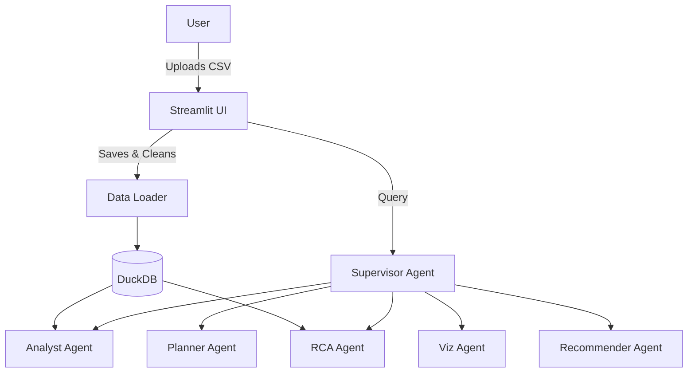

# Agentic AI Dashboard

An autonomous, multi-agent business intelligence platform that transforms raw data into actionable insights through automated analysis, visualization, SQL integrations, and root-cause investigation.

## 🚀 Overview

The Agentic AI Dashboard accepts arbitrary CSV datasets, infers their schema, and stores them in DuckDB. From there, users can engage with a coordinated swarm of specialized AI agents or directly run manual/natural-language SQL queries. The dashboard explains not just *what* changed, but *why*, and recommends next steps for your data exploration.

## 💡 Key Features
- **Intelligent Ingestion:** Automatic CSV schema inference and robust error handling.
- **Agentic Pipeline:** A deterministic swarm (Planner, Analyst, Viz, RCA, Recommender, Supervisor) to coordinate analytics.
- **SQL Analytics Engine:** Built-in SQL text entry, predefined analytic queries, and mock natural-language-to-SQL logic.
- **Automated Root Cause Analysis (RCA):** Deep dives into metric changes with percentage impact breakdowns.
- **Cloud-Ready Persistence:** Optional Google Cloud Storage artifact saving via the `GCP_BUCKET_NAME` environment variable, enabling stateless Cloud Run deployment.

## 🛠️ Tech Stack

- **Frontend**: Streamlit + Plotly
- **Data Engine**: Python 3.13, DuckDB (OLAP), Pandas
- **Intelligence**: Pydantic (Strong Typing)
- **Deployment**: Docker, Google Cloud Run

## 📖 Architecture



## 🎬 Demo Workflow

1. **Upload Data:** Drag and drop `test_data.csv` into the dashboard.
2. **Review Profiles:** Check the out-of-the-box missing values summary and automatically inferred data types in the "Automated Profiling" tab.
3. **Run Predefined SQL:** Go to the "SQL Analytics" tab and click "Top 10 Categories" or "Duplicates Check" to see data without writing SQL.
4. **Agentic Deep Dive:** Type "Why did sales drop in region North?" into the Intelligent Insights search box to see the RCA Agent and Recommender Agent in action.

## 🏃 How to Run Locally

### 1. Setup Environment
```bash
python -m venv .venv
source .venv/bin/activate  # Windows: .venv\Scripts\activate
pip install -r requirements.txt
```

### 2. Launch Dashboard
```bash
streamlit run app/dashboard.py
```

## ☁️ Deployment to Cloud Run

This project is Dockerized and ready for Google Cloud Run:

```bash
docker build -t agentic-ai-dashboard .
# Connect your cloud project
gcloud init
gcloud auth login
gcloud config set project YOUR_PROJECT_ID
# Deploy!
gcloud run deploy agentic-ai-dashboard \\
  --image gcr.io/YOUR_PROJECT_ID/agentic-ai-dashboard \\
  --platform managed \\
  --set-env-vars="GCP_BUCKET_NAME=my-artifact-bucket"
```
